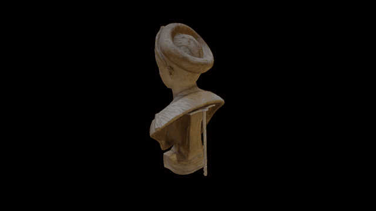

 

# Source data and models for a portrait bust of Claudia Olympias

Marble portrait bust of Claudia Olympias, with a funerary inscription within an incised frame.
Height: 64.77 centimetres
COL: [1812,0615.3] (http://www.britishmuseum.org/research/collection_online/collection_object_details.aspx?partId=1&objectId=465558)

Created from 138 photographs taken with a Nikon D5100 by Daniel Pett.

# LICENSE
The contents of this repository are licensed under CC-BY-NC-SA

# Credits
Photographs and models by Daniel Pett <dpett@britishmuseum.org>, Digital Humanities Lead, British Museum
